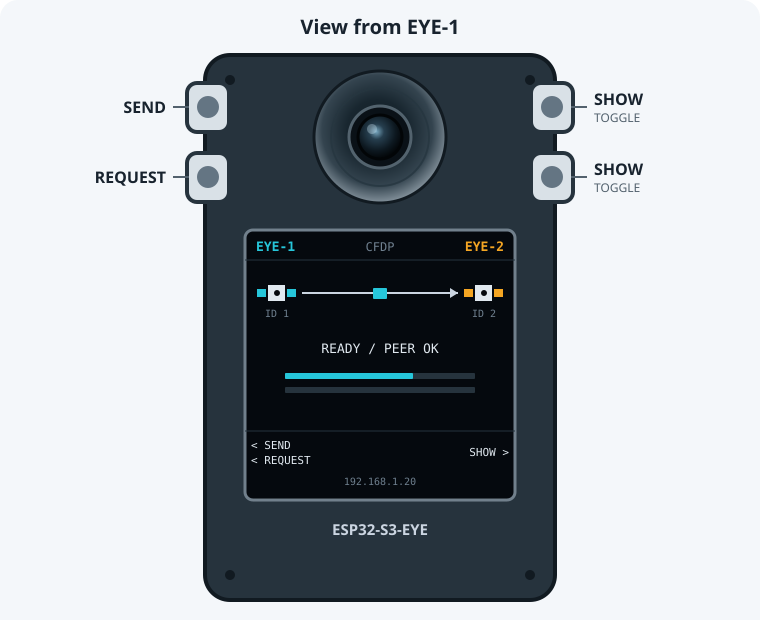

# CCSDS EYE demo

This demo uses two ESP32-S3-EYE boards to capture and exchange camera images
over CCSDS CFDP. The Space Packets generated by CFDP are carried in bidirectional, 
COP-1 flow-controlled USLP frames over Wi-Fi UDP to simulate a noisy, intermittent
radio link. 

Periodic peer-presence "ping" packets are exchanged while the link and CFDP service
are idle. This maintains visibility of link status in the absence of other traffic.
CLCW feedback caused by transfer traffic is immediate.

The goal is to demonstrate [CCSDS for Zephyr](https://github.com/abarmitage/zephyr-ccsds),
and to explore protocol tradeoffs when satellites use symmetrical flow-controlled
communication over USLP for bulk or high-rate data on inter-satellite links. 
One question is how far peers should autonomously recover and resynchronize after 
disruption before declaring a link failure.

SDLS security (GCM) authentication & encryption is used, anti-replay sequencing is enforced.
Automated recovery on link loss is discussed [below.](#sdls-anti-replay-initialisation--recovery)

## Controls

Wait until both displays have registered to Wi-Fi and show `READY / PEER OK`.

- **SEND** (upper-left): capture a fresh image on this board and send it to the
  other board.
- **REQUEST** (lower-left): ask the other board to capture a fresh image and
  send it back.
- **SHOW** (upper-right): display the latest valid image, whether
  it was captured locally or received from the other board. Press again to
  return to the protocol view.
- **LINK** (lower-right): show link and recovery status. Press **BACK** to
  return.

`SHOW` reports `NO IMAGE` until an image is available. A failed transfer does
not replace the last valid image.



The display is "egocentric" with the current board on the left and remote board
on the right. 

EYE-1 is shown in blue, EYE-2 is always orange

## Configure

Create the local configuration files:

```sh
cp conf/eye-1.example.conf conf/eye-1.conf
cp conf/eye-2.example.conf conf/eye-2.conf
```

Set both files to use:

- the same 2.4 GHz WPA2 network;
- two unused static IPv4 addresses outside the DHCP pool;
- the correct netmask and gateway;
- reciprocal peer addresses and UDP ports.

The example IP addresses must be replaced. The local configuration files are
ignored by Git so Wi-Fi credentials are not committed.

## Build and flash

Build both roles in the development container:

```sh
./build_both.sh
```

Flash the built images from the host:

```sh
./flash_both.sh /dev/ttyACM0 /dev/ttyACM1
```

The first device becomes EYE-1 and the second becomes EYE-2. Stable
`/dev/serial/by-id/...` paths are preferable when available. Install `esptool`
with `pipx install esptool` if it is not already present.

If the container can access both serial devices directly, build and flash in
one step:

```sh
./build_and_flash.sh /dev/ttyACM0 /dev/ttyACM1
```

## Try it

1. Press **SEND** on EYE-1. When EYE-2 reports successful reception, press
   **SHOW** on EYE-2 to see the captured EYE-1 image.
2. Repeat from EYE-2 to EYE-1.
3. Press **REQUEST** on EYE-1. EYE-2 captures an image and returns it; use
   **SHOW** on EYE-1 to view it.
4. Repeat the request in the opposite direction.

The progress bars show transferred image bytes. Reaching 100 percent means all
image data has arrived; CFDP checksum and completion confirmation follow as a
separate final step.

## Diagnostics

The **LINK** screen summarizes the current protocol state:

| Field | Meaning |
| --- | --- |
| `PEER` | Local transmit-side COP-1 state. |
| `V(R)` | Report Value in the latest CLCW received from the peer. |
| `LOCAL` | Local receive-side COP-1 state. |
| `VS` | Next transmit sequence number. |
| `VR` | Next receive sequence number. |
| `CFDP` | Current file-transfer state: `IDLE`, `TX`, `RX`, or `DUPLEX`. |

COP-1 counters:

| Field | Meaning |
| --- | --- |
| `WIN` | Outstanding frames / maximum transmit window (K). |
| `NNR` | Oldest unacknowledged transmit sequence number. |
| `RETX` | Frames retransmitted. |
| `TMOUT` | Retransmission-timer expirations. A timeout starts recovery but is not itself a terminal failure. |
| `WAIT` | WAIT conditions entered locally or reported by the peer. |
| `LKOUT` | Local or peer lockout transitions. |
| `EXH` | COP-1 retry-limit exhaustion. |
| `REJ` | Received USLP frames not accepted for data delivery. Causes include a malformed or mismatched frame, arrival while the local receiver is in WAIT or LOCKOUT, a sequence number ahead of the expected `VR`, or refusal by the packet-ingress path. |
| `DUP` | Frames already accepted and received again, normally because their acknowledgement was lost. They are not delivered twice to the application. |

LINK diagnostics:

| Field | Meaning |
| --- | --- |
| `QUEUE PEAK` | Highest ingress-queue use / capacity. |
| `DROP` | Datagrams dropped because the ingress queue was full. |
| `ROUTE` | Output-routing failures. |
| `UDP` | Last UDP error code (`0` means none), not a count. |
| `TERM` | Terminal COP-1 failures, normally associated with `EXH`. |

CFDP diagnostics:

| Field | Meaning |
| --- | --- |
| `NAK TX` | CFDP NAKs transmitted. |
| `NAK RX` | CFDP NAKs received. |
| `RETX` | CFDP-level retransmissions. |

COP-1 counters restart when **SYNC** reinitializes the link. Queue, UDP, and
CFDP diagnostics run from application startup. More detailed diagnostics are
written to the serial log.

## Protocol Comparison & Tradeoff

COP-1 retransmits any lost or damaged USLP frames before CFDP needs to recover
missing file data at space packet level.

> **Note:** No channel-coding layer is implemented in this demo (no BCH, no R-S, 
> no FECF). A damaged UDP datagram will normally be rejected by the UDP/IP
> stack and therefore appear to COP-1 as a missing frame in the
> flow-controlled sequence. COP-1 will then retransmit it. The outcome is 
> similar to a frame that channel coding detected but could not correct.

CFDP validates the completed image with a file checksum. With
COP-1 enabled at USLP frame level, CFDP gap recovery will rarely (if ever) be
needed, because lost frames are recovered by COP-1.

A packet-only version, in which CFDP performs this recovery, is
preserved by the [`demo-cfdp-packet`](#tagged-demonstration-versions) tag
described below.

It's interesting to compare the two configurations:

- **demo-uslp-cop1** - lost packets & frames are automatically recovered by
  COP-1 during transmission. The sender can attempt a higher transmit rate
  because the receiver's capacity to absorb frames is enforced by
  COP-1 flow control. This can improve throughput, at the cost of feedback 
  of CLCW in returned frames, even if the return link is idle.
- **demo-cfdp-packet** - after splitting the file into packets, and sending,
  CFDP automatically requests to fill any "gaps" in the received file.
  This requires CFDP to maintain a record of any missing areas
  in the received file, which uses memory, especially if missing packets are highly dispersed.
  Furthermore, the sender must impose a higher, fixed, per-packet transmit
  delay to ensure it does not overwhelm the receiver. The value of this delay
  depends on arbitrary platform & link constraints.

Clearly, flow-controlled is preferable, although in the demo, it "hides"
CFDP's ability to recover missing sections of a file.

## Initial Startup & Link Recovery

The demo represents two autonomous remote entities (“spacecraft”). Its goal is
to recover and resynchronize with minimal operator intervention after either
entity resets or loses the link.

Persisting protocol sequence state after every frame would increase storage
wear and operational complexity. The demo therefore treats COP-1 and SDLS
session state as volatile and explicitly handles the resulting differences
between peers after startup or reset.

### COP-1 Synchronization

After a reset, the peers may disagree about their expected Frame Sequence
Numbers. Attempting to continue without reconciliation can result in rejected
frames, retransmissions, or Lockout.

On initial CLCW acquisition after boot, the transmitter adopts the peer’s CLCW
Report Value and may send `BC_UNLOCK` if the peer is in Lockout. This allows
normal startup to reconcile automatically.

A later Lockout or retry exhaustion is reported as `LINK ERROR`, rather than
silently changing established link state. The **LINK** screen then provides
manual resynchronization controls; normally, pressing **SYNC** is sufficient.
The demo does not automatically send `SET_VR`.

`TRANSFER FAILED` is reserved for an image transfer that actually failed at
CFDP level.

### SDLS Anti-Replay Initialisation & Recovery

AES-GCM requires IVs to remain unique while a key is in use. The demo’s 96-bit
IV contains a 64-bit sender component and a 32-bit Anti-Replay Sequence Number
(ARSN). A reset returns the ARSN to zero, so an established receiver would
otherwise reject the restarted peer’s frames.

At each boot, the sender initializes the upper 64-bit component from entropy.
It then advances that component using a 64-bit Weyl sequence while incrementing
the ARSN modulo 2³². The complete IV is authenticated, while receive-side replay
enforcement is applied to the ARSN.

An operational receive association initially enters `ADOPT` state. Local
**SYNC** also deliberately re-arms this state. While armed, any ARSN may
establish the new baseline, but only after the frame passes authentication,
plaintext validation, and delivery. The receiver then returns to anti-replay 
sequence enforcement.

This supports automatic cold-start recovery, but recovery after an independent
restart currently requires **SYNC** on the peer that remained running. Because
the demo uses fixed prototype keys, a previously recorded valid frame could
establish the baseline while adoption is armed. Fully automatic authenticated
recovery requires fresh operational keys provisioned through OTAR, which is not
yet implemented.

## Tagged demonstration versions

Two annotated Git tags preserve the working demonstrations at different
protocol layers:

- `demo-cfdp-packet`: CFDP Space Packets are carried directly in UDP
  datagrams, with missing file data recovered by CFDP.
- `demo-uslp-cop1`: CFDP Space Packets are carried in USLP Transfer Frames,
  with link loss normally recovered by COP-1 before CFDP observes a gap.

To build either version, check out its tag and use the same role build script:

```sh
git switch --detach demo-cfdp-packet
./build_both.sh
```

or:

```sh
git switch --detach demo-uslp-cop1
./build_both.sh
```

Return to current development with `git switch main`. The ignored local Wi-Fi
configuration files remain in the working directory when switching versions.
