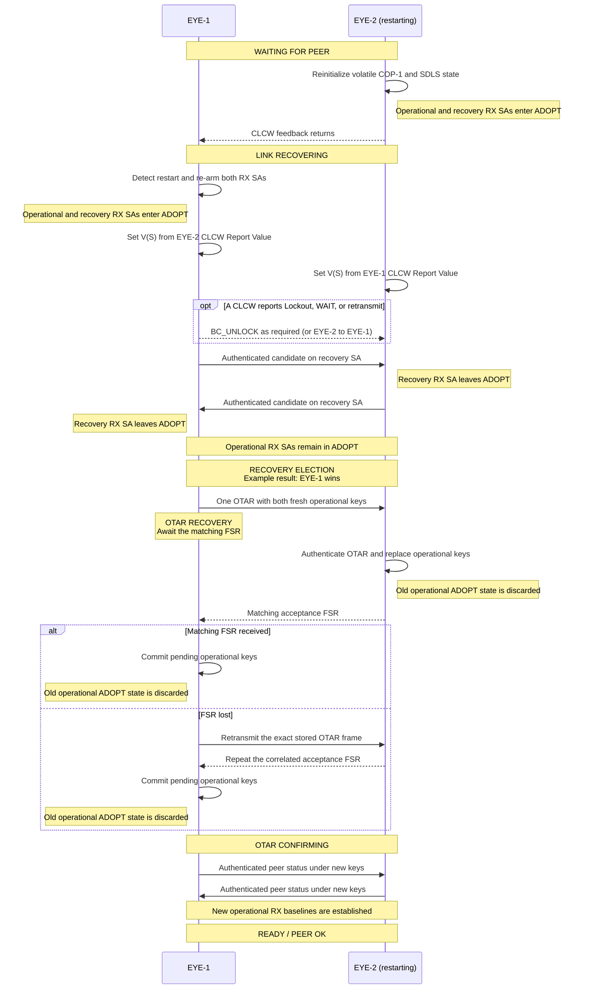

# CCSDS EYE demo

This demo uses two ESP32-S3-EYE boards to capture and exchange camera images
over CCSDS CFDP. The Space Packets generated by CFDP are carried in bidirectional,
COP-1 flow-controlled USLP frames over Wi-Fi UDP to simulate a noisy, intermittent
radio link.

Periodic "ping" packets are exchanged while the link and CFDP service
are idle. This maintains visibility of link status in the absence of other traffic.
CLCW feedback caused by transfer traffic is immediate.

SDLS security (GCM) authentication & encryption is used, anti-replay sequencing is enforced
during nominal operations. SDLS EP is partially used during link recovery.

The goal is to demonstrate [CCSDS for Zephyr](https://github.com/abarmitage/zephyr-ccsds),
and to explore protocol tradeoffs when satellites use symmetrical flow-controlled
communication over USLP for bulk or high-rate data on inter-satellite links.
A key question of the experiment is how the peers can autonomously recover and
resynchronize after disruption or link failure.

Automated recovery of COP-1, ARSN sequencing and key rotation on link loss is discussed
[below.](#initial-startup--link-recovery)

## Controls

Wait until both displays have registered to Wi-Fi and show `READY / PEER OK`.

- **SEND** (upper-left): capture a fresh image on this board and send it to the
  other board.
- **REQUEST** (lower-left): ask the other board to capture a fresh image and
  send it back.
- **SHOW** (upper-right): display the latest valid image, whether
  it was captured locally or received from the other board. Press again to
  return to the protocol view.
- **LINK** (lower-right): show link and recovery status. Press **BACK** to
  return.

`SHOW` reports `NO IMAGE` until an image is available. A failed transfer does
not replace the last valid image.


The display places the current board on the left and remote board
on the right. On both boards EYE-1 is shown in blue, EYE-2 in orange.

## Configure

Create the local configuration files:

```sh
cp conf/eye-1.example.conf conf/eye-1.conf
cp conf/eye-2.example.conf conf/eye-2.conf
```

Set both files to use:

- the same 2.4 GHz WPA2 network;
- two unused static IPv4 addresses outside the DHCP pool;
- the correct netmask and gateway;
- reciprocal peer addresses and UDP ports.

The example IP addresses must be replaced. The local configuration files are
ignored by Git so Wi-Fi credentials are not committed.

## Build and flash

Build both roles in the development container:

```sh
./build_both.sh
```

Flash the built images from the host:

```sh
./flash_both.sh /dev/ttyACM0 /dev/ttyACM1
```

The first device becomes EYE-1 and the second becomes EYE-2. Stable
`/dev/serial/by-id/...` paths are preferable when available. Install `esptool`
with `pipx install esptool` if it is not already present.

If the container can access both serial devices directly, build and flash in
one step:

```sh
./build_and_flash.sh /dev/ttyACM0 /dev/ttyACM1
```

## Try it

1. Press **SEND** on EYE-1. When EYE-2 reports successful reception, press
   **SHOW** on EYE-2 to see the captured EYE-1 image.
2. Repeat from EYE-2 to EYE-1.
3. Press **REQUEST** on EYE-1. EYE-2 captures an image and returns it; use
   **SHOW** on EYE-1 to view it.
4. Repeat the request in the opposite direction.

The progress bars show transferred image bytes. Reaching 100 percent means all
image data has arrived; CFDP checksum and completion confirmation follow as a
separate final step.

## Diagnostics

The **LINK** screen groups live state by protocol.

Top link state:

| Field | Meaning |
| --- | --- |
| `PEER` | Local transmit-side COP-1 state: `OK`, `WAIT PEER`, `RECOVERING`, `SYNC`, `CONTROL`, `RETRANSMIT`, `WAIT/RETX`, or `LOCKOUT`. |
| `V(R)` | Report Value in the latest CLCW received from the peer. |
| `LOCAL` | Local receive-side COP-1 state: `OPEN`, `WAIT`, or `LOCKOUT`. |
| `VS` | Next transmit sequence number. |
| `VR` | Next receive sequence number. |

COP-1 counters:

| Field | Meaning |
| --- | --- |
| `WIN` | Outstanding frames / maximum transmit window (K). |
| `NNR` | Oldest unacknowledged transmit sequence number. |
| `RETX` | Frames retransmitted. |
| `TMOUT` | Retransmission-timer expirations. Each timeout drives COP-1 retransmission; repeated timeouts can exhaust the retry limit and start link recovery. |
| `WAIT` | WAIT conditions entered locally or reported by the peer. |
| `LKOUT` | Local or peer lockout transitions. |
| `EXH` | COP-1 retry-limit exhaustion. |
| `REJ` | Received USLP frames not accepted for data delivery. Causes include a malformed or mismatched frame, arrival while the local receiver is in WAIT or LOCKOUT, a sequence number ahead of the expected `VR`, or refusal by the packet-routing path. |
| `DUP` | Frames already accepted and received again, normally because their acknowledgement was lost. They are not delivered twice to the application. |

LINK diagnostics:

| Field | Meaning |
| --- | --- |
| `QUEUE PEAK` | Highest ingress-queue use / capacity. |
| `DROP` | Datagrams dropped because the ingress queue was full. |
| `ROUTE` | Output-routing failures. |
| `UDP` | Last UDP error code (`0` means none), not a count. |
| `TERM` | Terminal COP-1 failures, normally associated with `EXH`. |

SDLS diagnostics:

| Field | Meaning |
| --- | --- |
| `EST` / `ADOPT` | Operational receive sequence state. `EST` enforces the established ARSN window; `ADOPT` permits one authenticated frame to establish a new baseline during startup or explicit recovery. |
| `TX/RX` | Newly protected transmit frames / successfully authenticated and decoded receive frames. Exact COP-1 retransmissions do not consume another transmit security operation. |
| `FSR` | FSR OCF occurrences transmitted / valid FSR OCFs received. Retransmission of a stored frame carrying an FSR is counted again. |
| `R/A/S` | Receive failures classified as replay-window / authentication-tag / security-association or key errors. |
| `OTAR` | Automatic recovery and key-rotation phase: waiting for the peer, recovering the link, electing the OTAR sender, awaiting OTAR acceptance, confirming the new operational keys, or confirmed. |
| `A/F` | Automatic recovery-election/OTAR attempts and failures. |

CFDP diagnostics:

The cyan heading row shows `CFDP` at the left and the current transfer state
(`IDLE`, `TX`, `RX`, or `DUPLEX`) at the right.

| Field | Meaning |
| --- | --- |
| `NAK TX` | CFDP NAKs transmitted. |
| `NAK RX` | CFDP NAKs received. |
| `RETX` | CFDP-level retransmissions. |

COP-1 counters and the SDLS frame, failure, and FSR counters restart when
**SYNC** reinitializes the link peer. Queue, UDP, and CFDP diagnostics run from
application startup. Detailed diagnostics are also written to the serial log.

## Protocol Comparison & Tradeoff

COP-1 retransmits any lost or damaged USLP frames before CFDP needs to recover
missing file data at space packet level.

> **Note:** No channel-coding layer is implemented in this demo (no BCH, no R-S,
> no FECF). A damaged UDP datagram will normally be rejected by the UDP/IP
> stack and therefore appear to COP-1 as a missing frame in the
> flow-controlled sequence. COP-1 will then retransmit it. The outcome is
> similar to a frame that channel coding detected but could not correct.

CFDP validates the completed image with a file checksum. With
COP-1 enabled at USLP frame level, CFDP gap recovery will rarely (if ever) be
needed, because lost frames are recovered by COP-1.

A packet-only version, in which CFDP performs this recovery, is
preserved by the [`demo-cfdp-packet`](#tagged-demonstration-versions) tag
described below.

It's interesting to compare the two configurations; clearly, COP-1 flow-controlled
is preferable, although in the demo, it "hides" CFDP's ability to recover missing
sections of a file. By comparison, without flow control CFDP must use an
arbitrary platform- and link-dependent delay to avoid swamping the receiver.

## Initial Startup & Link Recovery

The demo represents two autonomous remote entities (“spacecraft”) communicating
over a symmetrical USLP link. A goal is to autonomously and securely recover and
resynchronize with minimal operator intervention after either entity resets or
loses the link.

Persisting protocol sequence state after every frame would increase storage
wear and operational complexity. The demo therefore treats COP-1 and SDLS
session states as volatile and explicitly handles the resulting differences
between peers after startup or reset.

In the demo configuration, periodic peer-status packets keep COP-1 active
while the demo is otherwise idle. If an outstanding frame receives no
usable acknowledgement after 12 transmission attempts—because either the frame
or its returning CLCW feedback is lost—the configured 1.5-second retransmission
timer eventually exhausts its retry limit. The display changes to `WAITING FOR
PEER` while the service continues looking for returning CLCW feedback.

With UDP over Wi-Fi, this is occasionally observed after the demo has been idle
for several hours. These naturally occurring link failures are useful for
exercising and demonstrating the resynchronization and recovery procedures
under realistic conditions. The goal of the demo is not to eliminate link errors,
but to explore how flow control and security can be maintained—and how the link
can recover predictably with minimum intervention—when errors occur.

**SYNC** is a fallback operator action to trigger link recovery on user request;
it should not be needed while the displayed recovery sequence is still progressing.

### Automatic Recovery Sequence

The states shown on the main screen during recovery are:

| State | Meaning |
| --- | --- |
| `WAITING FOR PEER` | No usable peer feedback is currently arriving. The service continues listening and will resume automatically when the peer returns. |
| `LINK RECOVERING` | Peer feedback has returned and COP-1 is setting its transmit sequence from the peer's CLCW Report Value or completing control-frame synchronization. This is distinct from SDLS `ADOPT`. |
| `RECOVERY ELECTION` | Both EYEs exchange authenticated random candidates over their fixed maintenance SAs. The winner becomes the sole OTAR sender; the loser waits for that OTAR. This state also includes reliable candidate delivery and acknowledgement, so it may remain visible for several seconds. |
| `OTAR RECOVERY` | The elected winner has submitted one OTAR carrying fresh keys for both operational directions and is awaiting the matching FSR acceptance indication. |
| `OTAR CONFIRMING` | The new operational keys have been installed; the EYE is waiting for authenticated new-key traffic that proves its peer has also cut over. |
| `READY / PEER OK` | Authenticated peer status is flowing under the current operational keys and normal commands and transfers are enabled. |

The following example shows EYE-2 restarting and EYE-1 winning the random OTAR
election. The procedure is symmetric: either EYE may restart, return first, or
win the election.



Some transitions can complete between the display's 250-ms link snapshots, so
`OTAR RECOVERY` or `OTAR CONFIRMING` may appear only briefly. The final
authenticated peer-status exchange can add a short delay before `READY / PEER
OK` appears after key confirmation.

### COP-1 Synchronization

After a reset, the peers may disagree about their expected Frame Sequence
Numbers. Attempting to continue without reconciliation can result in rejected
frames, retransmissions, or Lockout.

On initial CLCW acquisition after boot, the transmitter adopts the peer’s CLCW
Report Value and may send `BC_UNLOCK` if the peer is in Lockout. This allows
normal startup to reconcile automatically.

A later Lockout or retry exhaustion starts automatic recovery. The main display
shows `WAITING FOR PEER` while no usable feedback is arriving and `LINK
RECOVERING` while COP-1 is converging. The **LINK** screen provides manual
resynchronization controls as a fallback, but they are not normally required.
The demo does not automatically send `SET_VR`.

### SDLS Anti-Replay Initialisation & Recovery

Each protected frame carries an initialization vector (IV) containing a
randomized sender value and a 32-bit Anti-Replay Sequence Number (ARSN). Under
normal operation, the receiver accepts only the next forward movement of
the ARSN. This prevents an old authenticated frame from simply being replayed.

A reboot restarts the ARSN at zero and chooses a new randomized IV
component. The peer cannot treat that as ordinary forward progress, so each
operational receive SA begins in `ADOPT` state. In `ADOPT`, the first
frame that passes authentication, decoding, and application delivery establishes
the new receive ARSN baseline.

Joint startup normally closes `ADOPT` automatically through authenticated
status traffic. If either EYE subsequently restarts, both sides automatically
reconcile COP-1, re-arm adoption where required, and rotate the two operational
traffic keys.

In `ADOPT` state, the receiver is temporarily exposed to a previously
recorded authenticated frame. This interval can be minimized by key rotation, but the
peers must first determine which party shall initiate an OTAR. This is
done by an automatic election, followed by OTAR initiated by the winner.

The demo uses one direct OTAR, confirmed by its correlated FSR,
and switches the operational SAs without a conventional activate/rekey/start-SA
command sequence. The fixed maintenance SAs are not rotated, so they
remain available if recovery traffic must be retransmitted.

Given volatile anti-replay state across reset, this autonomous recovery
procedure reduces the recovery replay exposure compared with conventional
manually coordinated SDLS recovery, while avoiding per-frame nonvolatile memory
writes.

## Tagged demonstration versions

Two annotated Git tags preserve the working demonstrations at different
protocol layers:

- `demo-cfdp-packet`: CFDP Space Packets are carried directly in UDP
  datagrams, with missing file data recovered by CFDP.
- `demo-uslp-cop1`: CFDP Space Packets are carried in USLP Transfer Frames,
  with link loss normally recovered by COP-1 before CFDP observes a gap.

To build either version, check out its tag and use the same role build script:

```sh
git switch --detach demo-cfdp-packet
./build_both.sh
```

or:

```sh
git switch --detach demo-uslp-cop1
./build_both.sh
```

Return to current development with `git switch main`. The ignored local Wi-Fi
configuration files remain in the working directory when switching versions.
